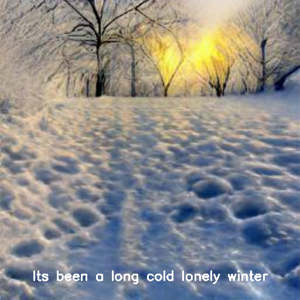
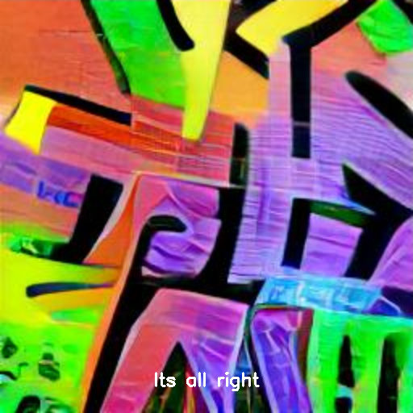

# Dall-e video clip maker

This small python project uses Dalle-mini, trough Replicate API, to generate a photo-montage video-clip 
from a song.

Given a youtube url the program will extract the audio and transcript of the video and use the lyrics
in the tarnscript as prompts for Dall-e mini.

## Usage
`python3 main.py <youtube url> --token <your replicate API token>`

An out output example for the video in "Here comes the sun" by the beatles":

 
 
 

Only works with youtube videos that have transcription.

# Blogspot
## 1. Interact with Replicate API to run DAll-e mini.
Replicate is a ..
The Replicate API allows integrating all Replicate models inside a python script which is the core of this project.

All the machinery is wrapped in the **DalleImageGenerator** class in **dall_e.py** which does all the interactio with Replicate.
Let's have a look at the code it runs in order to generate images from text

In order to create an API object and specifythe module we want to use we first need an API tokne
which is available [here](https://replicate.com/docs/api) for members of Replicate:
No run
```
import os
import replicate
os.environ["REPLICATE_API_TOKEN"] = <Your Api access token from     
dalle = replicate.models.get("kuprel/min-dalle")
urls = self.dalle.predict(text=<your prompt>, grid_size=<How many images to generate>, log2_supercondition_factor=<A parameter controlling the output relevance to text>)
```
The model in this case returns a list of urls to all intermediate images generated by dall-e.
We want the final output so we call 
```
get_image(list(urls)[-1])
```
to download the last one using python's urllib library

## 2. Downloading content from youtube.
All the code in this section appear in **download_from_youtube.py**

### Downloading the transcript.
There is a very cool python package called **YouTubeTranscriptApi** and, as its name implies, it's going to be very usefull

The **YouTubeTranscriptApi.get_transcript** function needs a youtube video ID so we'll first extract if from the video url using urllib:
The function **get_video_id** in the file does exactly that

and the main lines of code to get the transcripts are:

```
id = get_video_id(url)
transcript = YouTubeTranscriptApi.get_transcript(id, languages=['en'])
```
str is a python dictionary with entries 'text', 'star' 'duration'
indicating the starting time of each line of the lyrics and its duration.

### Downloading te audio
I used a library called **youtube_dl** that can download an .mp3 file with the sound of a youtube video.
Teh usage is pretty simple and is wrapped in the download_mp3 function in the file
```
import youtube_dl
ydl_opts = {
    'outtmpl': <specify output file path>,
    'format': 'bestaudio/best',
    'postprocessors': [{
        'key': 'FFmpegExtractAudio',
        'preferredcodec': 'mp3',
        'preferredquality': '192',
    }],
}
with youtube_dl.YoutubeDL(ydl_opts) as ydl:
    ydl.download([url])
```

## 3. Making a video clip
The rest of the code is conceptualy simple. use the transcript lines as prompts to dall-e, get images and combine
them with the .mp3 to video clip.
In practice there are some things to pay attention to in order to make the timing of the lyrics sound and visuals play together.

Let's go through the code:
We loop over the transcript dictionary we previously downloaded
```
for (text, start, end) in transcript:
```
Given the duration of the current and an input argument args.sec_per_img we calculate how many images wee need.
Also Dalle-mini generates a square grid of images so if we want N images we need to tell it to generate a grid of
dimension <pre xml:lang="latex">\sqrt{N}</pre>. The calculation is
```
    grid_size = max(get_sqrt(duration / args.sec_per_img), 1)
```

Now we ask Replicate for images from Dall-e mini:
```
    images = dalle.generate_images(text, grid_size, text_adherence=3)
```
If we want to generate a movie clip in a specific fps (Higher fps mean more accuracy in the timing because we can
change image more frequently) we usually need to write each image for multiple frames.
The calcualtion I did is 
```
    frames_per_image = int(duration * args.fps) // len(images)
```
Now we use **opencv** pacakge to write the lyrics as subtitles on the frame
```
    frame = cv2.cvtColor(images[j], cv2.COLOR_RGBA2BGR)
    frame = put_subtitles_on_frame(frame, text, resize_factor)
    frames.append(frame)
```
Where **put_subtitles_on_frame** is a function in utils.py that makes use of the **cv2.putText** function

Finaly, we can write all the aggregated frames into a file:
```
    video = cv2.VideoWriter(vid_path, 0, args.fps, (img_dim , img_dim))
    for i, frame in enumerate(frames):
        video.write(frame)
    cv2.destroyAllWindows()
    video.release()
```
The code itself is in  the **get_frames** function in **main.py** and is a little bit more elaborated. It also fills the
gaps parts of the song where there are no lyrics with images propmted by the last sentence or the song's name.

## 4. Sound and video mixing.
Now that we have video we only need to mix it with the downloaded .mp3 file.
We'll use FFMPEG for this with Shell commands executed from python
The first of the two commands below cuts the mp3 file to fit the length of the generated video in cases where the lyrics
doesn't cover all the song. The second command mixes the two into a new file with video and soun
```
os.system(f"ffmpeg -ss 00:00:00 -t {video_duration} -i '{mp3_path}' -map 0:a -acodec libmp3lame '{f'data/{args.song_name}/tmp.mp3'}'")
os.system(f"ffmpeg -i '{vid_path}' -i '{f'data/{args.song_name}/tmp.mp3'}' -map 0 -map 1:a -c:v copy -shortest '{final_vid_path}'")
```

# Todo
- [ ] Fix subtitles no whitespace problems
- [ ] Allow working on raw .mp3 and .srt files intead of urls only
- [ ] Support automatic generated youtube transcriptions
- [ ] Better timing of subtitles and sound
- [ ] Find way to upload video without copyrights infringement
- [ ] Use other text to image models from Replicate